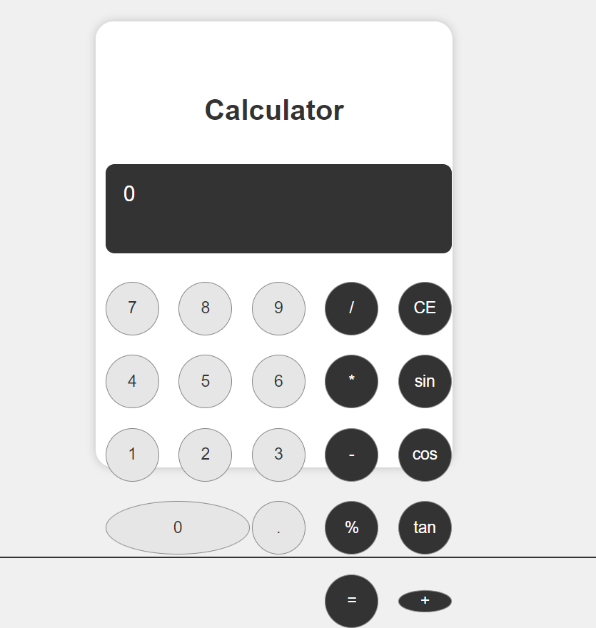

# React Calculator

This React Calculator is a simple yet powerful web application built to demonstrate proficiency in React.js and modern web development practices. The application offers a user-friendly interface for performing basic arithmetic operations, making it suitable for anyone needing a handy calculator on their computer or mobile device.

## **Features**

* **Basic Arithmetic** : Perform addition, subtraction, multiplication, and division.
* **Intuitive Design** : A clear, responsive layout that works on both desktop and mobile browsers.
* **Error Handling** : Gracefully handles division by zero and other common calculation errors.
* **React.js Framework** : Built using React.js, showcasing component-based architecture.

## **Running the Application**

To run the React Calculator locally, follow these steps:

### Prerequisites

* Ensure you have Node.js installed on your system. This will include `npm`, which is required to install dependencies and run the project.

### Setup

1. **Clone the Repository** :

* Use `git clone [repository-url]` to clone the project repository to your local machine. Replace `[repository-url]` with the URL of the repository.

1. **Navigate to the Project Directory** :

* After cloning, change your directory to the project's root folder (where the `package.json` file is located) using `cd react-calculator` (replace `react-calculator` with the appropriate directory name).

1. **Install Dependencies** :

* Run `npm install` in the terminal. This command will download and install all the necessary node modules required for the application.

### Running the Application

1. **Start the Application** :

* In the project directory, execute `npm start`. This will start the React application on a local development server.

2. **Access the Application** :

* Open a web browser and visit `http://localhost:3000`. You should now see the React Calculator running.

3. **Usage** :

* Use the calculator interface to perform basic arithmetic operations.
  When you run the application it should look like this 

  

### **Shutting Down**

* To stop the application, go back to the terminal where it's running and press `Ctrl + C`.

## **Notes**

* The application is built for learning purposes and showcases basic React functionalities.
* If you encounter any issues while running the application, ensure that your Node.js and npm versions are up to date.

## **Have Fun & Enjoy Calculating**
